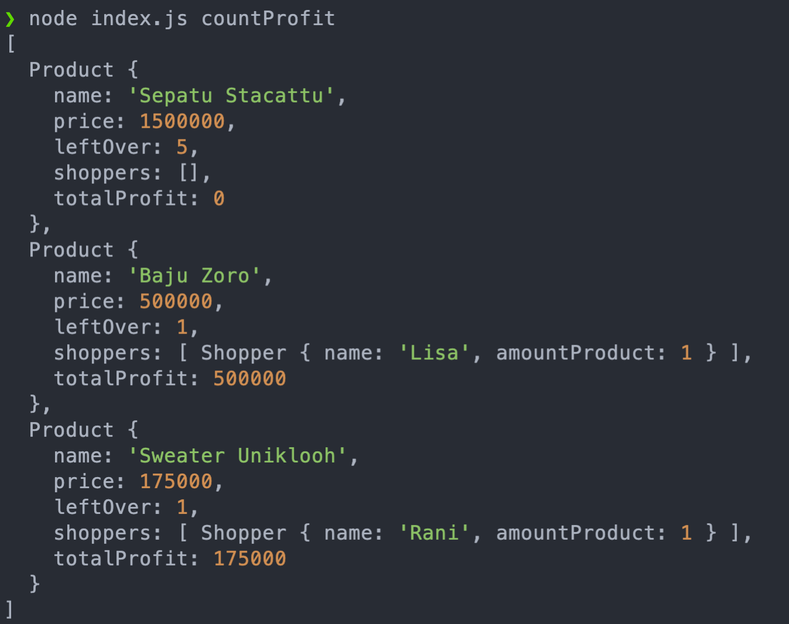
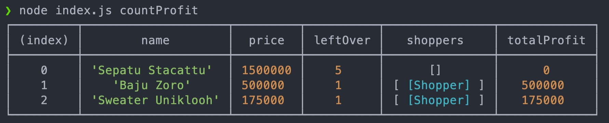

# Review MVC Callback

## Release 0

terdapat **`class Product`** dengan property :
Property    | Value
------------|-----------
name        | String
price       | Number
leftOver    | Number
shoppers    | Array
totalProfit | Number


terdapat **`class Shopper`** dengan property :
Property      | Value 
--------------|-----------
name          | String
amountProduct | Number

</br>

&nbsp;&nbsp;&nbsp;&nbsp;&nbsp;&nbsp;&nbsp;&nbsp;&nbsp;&nbsp;Tapi sebelum membahas lebih dalam ke `release 1 & 2` coba kita review balik mengenai **`Callback di MVC`** yang telah menghilangkan `return` favorite kalian 😅 😅 😅 😅. 
Kita buat MVC yang memberikan output berupa data di `data.json` tidak perlu di instance ya, kita fokus ke callbacknya aja dulu. Gunakan command ini ⤵️  
```
node index.js countProfit
```

> 1. Apakah callback hanya untuk async. benar atau tidak? 
> 2. Apa bedanya `Callback & Modular Function`? 


## Release 1 

Kita akan membuat Challenge di phase lalu menjadi versi **MVC + Callback**.  
Fitur pertama adalah read yang akan membaca data pada `data.json` dengan command seperti berikut :

```
node index.js countProfit
```


</br>
</br>



## Release 2

```
node index.js addShopper <name> <productName> <amount> 
```

Saat command tersebut di jalankan maka data shopper pada `data.json` akan bertambah apabila sisa produk yang dicari masih tersedia. 

```diff
+ tidak mengubah format pada data.json 
```

### Case 1 
`$ node index.js addShopper Devi "Baju Zoro" 1`  
Product Baju Zoro memiliki leftOver 2.

Output : 
```
=======
SUCCESS
=======
Devi berhasil belanja "Baju Zoro" 
```

### Case 2 
`$ node index.js addShopper Devi "Baju Zoro" 50`  
Product Baju Zoro memiliki leftOver 1.

Output : 
```
=================================
Sorry we can't full your request
=================================
```

### Case 3
`$ node index.js addShopper Devi "Baju Ozro" 1`  
Tidak terdapat product bernama Baju Ozro

Output : 
```
=================================
Sorry we can't full your request
=================================
```